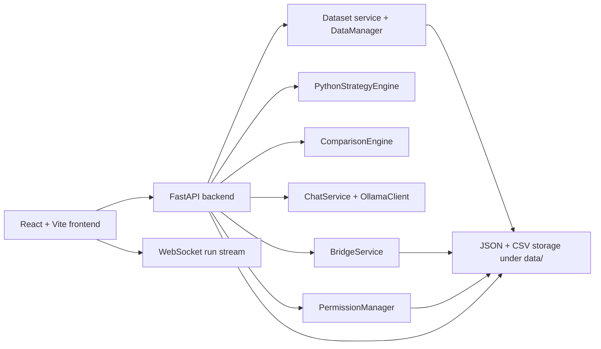

# Architecture Overview

This file describes the architecture that is currently implemented in code, and also calls out the planned architecture that still exists only as design intent.

## Current runtime architecture

## Implemented architecture

- Frontend:
  - React + TypeScript + Vite
  - React Router for `/imports`, `/workspace`, `/runs`, and `/settings`
  - `lightweight-charts` for candle and overlay series rendering
- Backend:
  - FastAPI REST endpoints
  - WebSocket stream for run progress updates
  - Local Python execution through `PythonStrategyEngine`
  - Manual Pine bridge artifact ingestion through `BridgeService`
  - Ollama integration through `ChatService` and `OllamaClient`
- Active storage:
  - dataset CSV files
  - JSON indices and artifacts under `data/cache` and `data/artifacts`

## Planned architecture that is not active yet

- SQLite for metadata and approvals
- DuckDB and Parquet for candle persistence and analytical artifacts
- Automated TradingView bridge worker
- Market-data provider ingestion for Polygon and future adapters
- Dedicated background worker processes outside the main API process

## Execution modes

### `local_compare`

- Uses a saved dataset from Excel or CSV
- Runs the Python strategy locally
- Uses an optional manual Pine bridge artifact for Pine truth
- Best for deterministic replay and indicator debugging

### `pine_bridge`

- Uses a saved dataset plus an attached bridge artifact
- Treats the uploaded Pine artifact as the source of truth for Pine values
- Best for exact parity checks when the user exports Pine results externally

## Current "live" behavior

The current `live` run mode is not a network-backed market feed.
It replays a saved dataset incrementally:

- warmup bars are loaded first
- the remaining bars are appended one bar per second
- Python outputs and comparison results are recalculated at each step
- a WebSocket emits progress snapshots for the selected run

## Approval model

- Read access can be granted and stored in permission history
- Write access remains explicit and short-lived
- Chat requests with `apply_fix` are blocked unless Python write permission is active
- The current frontend exposes approval toggles and status, but does not yet apply returned patches into files

## Comparison contract

All engines are normalized into the same payload shape:

- candle points
- indicator series
- trade events
- mismatch details
- warnings
- run metadata

Comparison happens after alignment by:

- symbol
- timeframe
- timezone
- timestamp or bar index
- tolerance

## Related docs

- [Project Overview](project-overview.md)
- [Workflow](workflow.md)
- [API Reference](api-reference.md)
- [Current Status](current-status.md)
