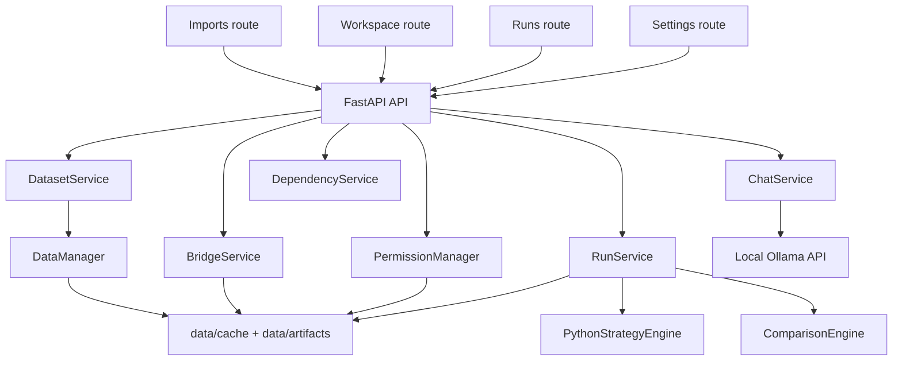

# Project Overview

## Purpose

Trading Strategy Comparator is a local-first application for checking whether a Pine Script strategy and a Python strategy produce the same indicator values and trade behavior on the same candle set.

The primary goal is parity analysis:

- compare indicator outputs
- compare trade events
- find the first divergence
- explain likely causes
- help the user inspect or fix the Python side with a local Ollama assistant

## Product scope

The current product supports:

- imported Excel and CSV datasets
- deterministic replay on saved candles
- dataset-backed incremental playback called `live`
- manual Pine bridge artifacts uploaded through the UI
- local Python strategy execution
- LLM analysis using locally installed Ollama models

The current product does not yet support:

- fully automated TradingView export capture
- broker execution
- exchange-connected real-time streaming
- multi-user authentication
- production-grade secure sandboxing

## Current maturity

- Stage: `alpha / local pilot`
- Intended user: one user on one machine
- Intended use: historical comparison, debugging, and workflow validation
- Not intended use: unattended production trading or multi-user hosted deployment

## Architecture in one view

## Current architecture versus target architecture

| Area | Current implementation | Target design |
| --- | --- | --- |
| Frontend | React + Vite + route-based shell | Same, with richer chart sync and workflows |
| Backend | FastAPI with in-process services | Same API shape, with more isolated workers |
| Storage | JSON + CSV artifact storage | SQLite + DuckDB + Parquet |
| Pine truth | Manual bridge artifact upload | Automated TradingView bridge plus manual fallback |
| Live mode | Dataset playback one bar per second | Provider-backed live bars with replay continuation |
| LLM | Ollama chat + fallback + model discovery | Same, plus patch apply and deeper grounding |

## Key files

### Frontend entry points

- `frontend/src/app/App.tsx`
- `frontend/src/pages/ImportsPage.tsx`
- `frontend/src/pages/WorkspacePage.tsx`
- `frontend/src/pages/RunsPage.tsx`
- `frontend/src/pages/SettingsPage.tsx`

### Backend entry points

- `backend/app/main.py`
- `backend/app/api/*.py`
- `backend/app/services/*.py`
- `backend/app/core/python_engine.py`
- `backend/app/core/comparison_engine.py`
- `backend/app/core/data_manager.py`

### Shared contracts

- `shared/python/contracts.py`
- `shared/typescript/contracts.ts`

## Core entities

### Dataset

A saved candle source normalized into:

- `timestamp`
- `open`
- `high`
- `low`
- `close`
- `volume`

### Strategy artifact

User-provided source code plus metadata:

- Pine artifact
- Python artifact
- declared outputs
- read/write permissions

### Run

A replay or live execution record containing:

- candle window
- Python indicator series
- Pine indicator series
- trade events
- comparison result
- lifecycle and progress

### Bridge artifact

User-uploaded Pine output bundle containing:

- indicator series
- trade events
- optional source code snapshot

### Chat request

A local Ollama analysis request with:

- selected model
- intent
- latest messages
- optional run context
- requested access targets

## Recommended future reading order

For a new developer or AI agent:

1. Read [Current Status](current-status.md)
2. Read [Workflow](workflow.md)
3. Read [API Reference](api-reference.md)
4. Read [AI Handoff](ai-handoff.md)
5. Open the key files listed above
